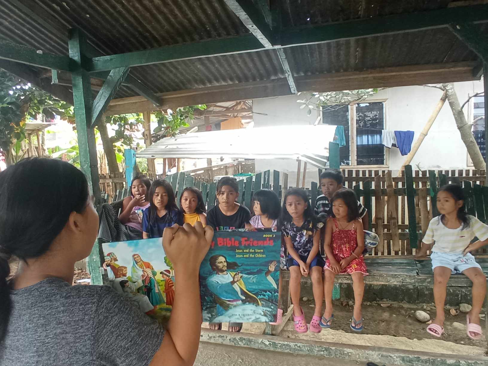

<Blockquote name="Vision">
“Our children are our hope for our nation’s future.”
</Blockquote>
 

For that reason, Sibagat Fundamental Baptist Church must invest effort, time, and finances to reach out to the children of our society.

We believe that children learn about having a relationship with God by engaging with people who have a relationship with Him.

As we live lives transformed before our children, they experience the power and presence of God.

We provide consistent leaders who connect with our children regularly and guide them in discovering God.

We believe that children learn and retain the most through experience.

We aim to give children an adventure in learning that will impact them for eternity.

We offer experiences that are developmentally appropriate, involving and engaging them in the learning process.

 
<Blockquote name="Elrio">
“Childrens Ministry - Elrio.”
</Blockquote>

<video width="368" controls="" onmouseover="this.play()" onmouseout="this.pause()" loop muted preload="metadata"><source src="/assets/ministries/childrens/childrens-ministry-elrio.mp4" type="video/mp4"></video>

<video width="368" controls="" onmouseover="this.play()" onmouseout="this.pause()" loop muted preload="metadata"><source src="/assets/ministries/childrens/childrens-ministry-elrio2.mp4" type="video/mp4"></video>

<video width="368" controls="" onmouseover="this.play()" onmouseout="this.pause()" loop muted preload="metadata"><source src="/assets/ministries/childrens/childrens-ministry-elrio3.mp4" type="video/mp4"></video>

<video width="368" controls="" onmouseover="this.play()" onmouseout="this.pause()" loop muted preload="metadata"><source src="/assets/ministries/childrens/childrens-ministry-elrio4.mp4" type="video/mp4"></video>

 
 
<Blockquote name="Prk-13">
“Childrens Ministry - Prk-13.”
</Blockquote>

<video width="368" controls="" onmouseover="this.play()" onmouseout="this.pause()" loop muted preload="metadata"><source src="/assets/ministries/childrens/childrens-ministry-p13-2.mp4" type="video/mp4"></video>

<video width="368" controls="" onmouseover="this.play()" onmouseout="this.pause()" loop muted preload="metadata"><source src="/assets/ministries/childrens/childrens-ministry-p13-3.mp4" type="video/mp4"></video>

<video width="368" controls="" onmouseover="this.play()" onmouseout="this.pause()" loop muted preload="metadata"><source src="/assets/ministries/childrens/childrens-ministry-p13-1.mp4" type="video/mp4"></video>

<video width="368" controls="" onmouseover="this.play()" onmouseout="this.pause()" loop muted preload="metadata"><source src="/assets/ministries/childrens/childrens-ministry-p13.mp4" type="video/mp4"></video>

 
 
<Blockquote name="Sibagat">
“Childrens Ministry - Sibagat.”
</Blockquote>

<video width="368" controls="" onmouseover="this.play()" onmouseout="this.pause()" loop muted preload="metadata"><source src="/assets/ministries/childrens/childrens-ministry-sibagat2.mp4" type="video/mp4"></video>

<video width="368" controls="" onmouseover="this.play()" onmouseout="this.pause()" loop muted preload="metadata"><source src="/assets/ministries/childrens/childrens-ministry-sibagat.mp4" type="video/mp4"></video>

